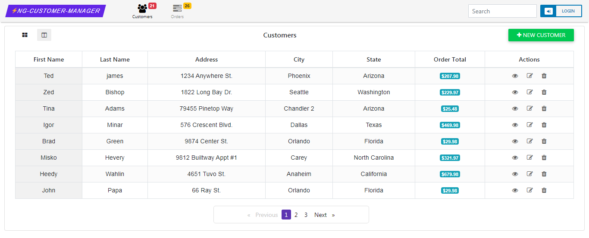

# NgCustomerManager

The aim of this project is to build a modular and scalable application using Angular 9 and NodeJS/Express. 

# ScreenShots

Customers Card View :

Customers Grid View :

Customer Details :

Customer Orders :

Edit Customer :

Orders View :

This project was generated with [Angular CLI](https://github.com/angular/angular-cli) version 9.0.1.

Technology Stack : 

* Angular 9
* NgRx/data
* RxJS 6
* NodeJS/Express

# Application Modules 
The application is splitted into several modules. The image below represents the modules implemented in this application.

* **Core Module** : Core of the application
* **Shared Module** : Contains shared features such as pipes, animations and several utility classes.
* **Customers Module** : Browse a collection of customers in Grid/Card view
* **Customer Module** : Contains customer details and orders
* **Orders Module** : Browse a collection of orders

## Development server

Run `ng serve` for a dev server. Navigate to `http://localhost:4200/`. The app will automatically reload if you change any of the source files.

## Code scaffolding

Run `ng generate component component-name` to generate a new component. You can also use `ng generate directive|pipe|service|class|guard|interface|enum|module`.

## Build

Run `ng build` to build the project. The build artifacts will be stored in the `dist/` directory. Use the `--prod` flag for a production build.

## Running unit tests

Run `ng test` to execute the unit tests via [Karma](https://karma-runner.github.io).

## Running end-to-end tests

Run `ng e2e` to execute the end-to-end tests via [Protractor](http://www.protractortest.org/).

## Further help

To get more help on the Angular CLI use `ng help` or go check out the [Angular CLI README](https://github.com/angular/angular-cli/blob/master/README.md).

## Contributors  

**@author:** 'Fahmi BEN SALAH *< [fahmii.bensalah@gmail.com](mailto:fahmii.bensalah@gmail.com) >*' 

### Contributing
If you like the project, shoot a :star2: and feel free to fork & send PR anytime.
